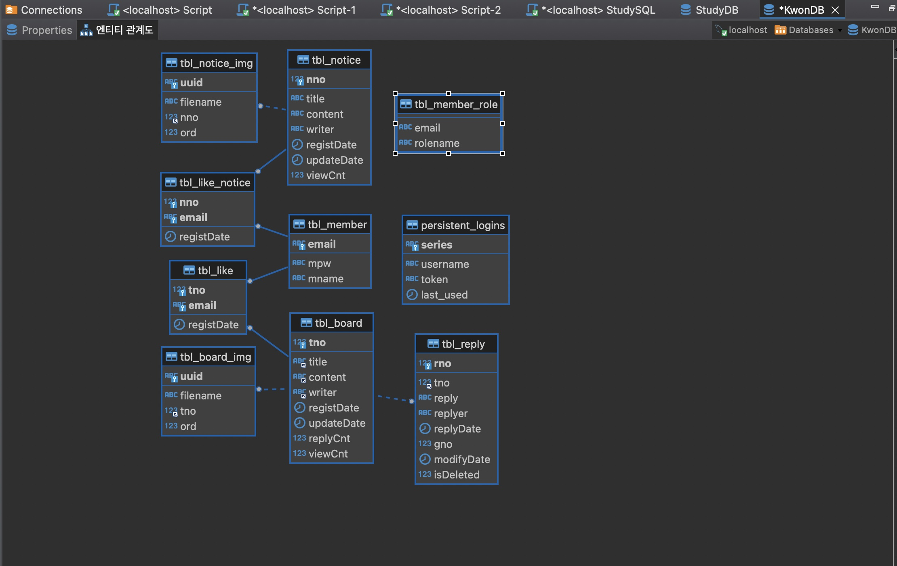

# 개발 상태 : [개발 완료]
# [게시판 CRUD, 조회수, 검색, 댓글대댓글, 파일업로드 개발 완료 , Spring Security(kakao social login) 개발 완료, 좋아요 개발 완료, 공지사항 개발 완료]

# board-comments-fileupload-paging-search-mvc
- 프로젝트 유형: Board 게시판 토이 프로젝트
- 목표: JavaScript, Thymeleaf, Spring Boot 를 활용하여 페이지네이션, 검색 기능이 포함된 Board 애플리케이션 개발
- 목표: 개발의 순서 정립 DataBase , Index 설계 , Query 속도 향상 & Query 문법 정립 

## Spring Boot 프로젝트 설정

### 빌드 플러그인
- `java`: Java 플러그인을 사용하여 프로젝트에 Java 컴파일 기능을 추가합니다.
- `org.springframework.boot`: Spring Boot 기능을 프로젝트에 추가합니다. 버전은 3.1.1으로 설정됩니다.
- `io.spring.dependency-management`: Spring의 의존성 관리 기능을 추가합니다. 버전은 1.1.0입니다.

### 프로젝트 정보
- `group`: 프로젝트 그룹 ID를 'board.file'로 설정합니다.
- `version`: 프로젝트 버전을 '0.0.1-SNAPSHOT'으로 설정합니다.
- `sourceCompatibility`: 프로젝트 Java 버전을 17로 설정합니다.

## 시작하기(Getting Start)

### 사전 요구 사항
- Java 17
- MySQL
- 웹 브라우저

### 데이터베이스 설정
프로젝트를 실행하기 전에 MySQL 데이터베이스를 설정하고 `application.properties` 파일에서 데이터베이스 연결 속성을 구성하세요.

### 빌드 및 실행 방법
1. 이 저장소를 복제하거나 다운로드합니다: `git clone [repository_url]`
2. 프로젝트를 빌드합니다: `./gradlew build`
3. 애플리케이션을 실행합니다: `./gradlew bootRun`
4. 웹 브라우저에서 애플리케이션에 접속합니다: `http://localhost:8084/board/list`

## 부트스트랩 사용
이 프로젝트는 부트스트랩 템플릿을 사용하여 사용자 인터페이스를 구성합니다. 템플릿에 대한 자세한 정보는 [AdminLTE](https://adminlte.io/)를 참조하세요.

### 주요 기능
- Board 항목 생성, 조회, 수정, 삭제
- 페이지네이션 지원
- Board 항목 title, content, writer 검색 지원 
- Board 항목 필터링 및 정렬 기능
- 페이지네이션 지원 

- Reply 항목 생성, 조회, 수정, 삭제
- 페이지네이션 지원

- File 항목 생성, 조회, 수정, 삭제
- File 항목 생성 수정 시 Thumnail 생성
- Eningx 를 통한 Ajax 통신

- 공지사항 항목 생성, 조회, 수정, 삭제
- 공지사항 Board List 상단 고정 기능
- 공지사항 항목 title, content, writer 검색 지원
- 공지사항 항목 필터링 및 정렬 기능
- 페이지네이션 지원 

- 좋아요 기능 회원을 통한 생성, 삭제, 좋아요 수 Count

- 조회수 기능 Cookie 를 통한 생성 

- Bootstrap을 이용한 반응형 웹 디자인

## 개발자 정보
- 이름: [권성준]
- 이메일: [thistrik@gmail.com]
- 이메일: [thistrik@naver.com]

## 피드백 기여 및 지원 기타 문의 
- 프로젝트에 대한 의견과 피드백은 언제나 환영합니다! 만약 프로젝트에 대한 개선 사항이나 버그 제보, 그 외 다른 의견이 있으시면, 언제든지 연락해주시기 바랍니다.

## Database_Diagram



## 데이터베이스 테이블 정보

### Board 테이블 (`tbl_board`)
| 컬럼명   | 데이터 타입     | 설명                                       |
|----------|----------------|--------------------------------------------|
| tno      | INT            | Board 항목의 고유 식별자 (Primary Key, 자동 증가) |
| title    | VARCHAR(500)   | Board 항목의 제목 (null이 아님)                |
| content  | VARCHAR(1000)  | Board 항목의 상세 내용 (null이 아님)           |
| writer   | VARCHAR(100)   | Board 항목을 생성한 사용자명 (null이 아님)     |
| registDate | TIMESTAMP        | Board 의 생성 날짜          |
| updateDate  | TIMESTAMP           | Board 의 업데이트 날짜                        |
| replyCnt | INT | Board 의 댓글 개수 |
| viewCnt | INT | Board 의 조회수|

### Board Image 테이블 (`tbl_board_img`)
| 컬럼명   | 데이터 타입     | 설명                                       |
|----------|----------------|--------------------------------------------|
|uuid	|VARCHAR(50)	|이미지 항목의 고유 식별자 (Primary Key)
|filename|	VARCHAR(200)	|이미지 파일 이름 (null이 아님)
|tno	|INT	|관련 Board 항목의 고유 식별자
|ord	|INT	|이미지 순서 (기본값 0)

### Board Reply 테이블 (`tbl_reply`)
| 컬럼명 | 데이터 타입 | 설명 |
| --- | --- | --- |
| rno | INT | 답글 항목의 고유 식별자 (Primary Key, 자동 증가) |
| tno | INT | 관련 Board 항목의 고유 식별자 |
| reply | VARCHAR(1000) | 답글의 내용 |
| replyer | VARCHAR(100) | 답글을 작성한 사용자명 |
| replyDate | TIMESTMAP | 답글이 작성된 날짜와 시간 (기본값은 현재 시간) |
| modifyDate | TIMESTMAP | 답글이 수정된 날짜와 시간 (기본값은 현재 시간) |
| gno | INT | 그룹 번호 (기본값 0) |
|isDeleted| TINYINT | 댓글.대댓글이 삭제되었는지 확인하고 업데이트|

### Board Like 테이블 (`tbl_like`)
| 컬럼명 | 데이터 타입 | 설명 |
| --- | --- | --- |
|tno|	INT|	"좋아요"가 달린 게시글의 고유 식별자 (외래키, tbl_board 참조)|
|email|	VARCHAR(100)|	"좋아요"를 누른 회원의 이메일 주소 (외래키, tbl_member 참조)|
|registDate|	TIMESTAMP|	"좋아요"가 등록된 날짜 및 시간 (기본값: 현재 시간)|

### Notice 테이블 (`tbl_notice`)
| 컬럼명 | 데이터 타입 | 설명 |
| --- | --- | --- |
|nno	|INT	|공지사항 항목의 고유 식별자 (Primary Key, 자동 증가)|
|title	|VARCHAR(500)	|공지사항 항목의 제목 (null이 아님)|
|content	|VARCHAR(700)	|공지사항 항목의 상세 내용 (null이 아님)|
|writer	|VARCHAR(100)	|공지사항 항목을 생성한 사용자명 (null이 아님)|
|registDate	|TIMESTAMP	|공지사항 항목의 생성 날짜|
|updateDate	|TIMESTAMP	|공지사항 항목의 업데이트 날짜|
|viewCnt	|INT	|공지사항 항목의 조회수|

### Notice Image 테이블 (`tbl_notice_img`)
| 컬럼명 | 데이터 타입 | 설명 |
| --- | --- | --- |
|uuid	|VARCHAR(50)	|이미지 항목의 고유 식별자 (Primary Key)|
|filename	|VARCHAR(200)	이미지 파일 이름 (null이 아님)|
|nno	|INT	|관련 공지사항 항목의 고유 식별자|
|ord	|INT	|이미지 순서 (기본값 0)|

### Notice Like 테이블 (`tbl_like_notice`)
| 컬럼명 | 데이터 타입 | 설명 |
| --- | --- | --- |
|nno	|INT	|"좋아요"가 달린 공지사항 항목의 고유 식별자 (외래키, tbl_notice 참조)|
|email	|VARCHAR(100)	|"좋아요"를 누른 회원의 이메일 주소 (외래키, tbl_member 참조)|
|registDate	|TIMESTAMP	|"좋아요"가 등록된 날짜 및 시간 (기본값: 현재 시간)|

### Member 테이블 (`tbl_member`)
| 컬럼명 | 데이터 타입 | 설명 |
| --- | --- | --- |
|email|VARCHAR(100)| 회원의 이메일 주소 (Primary Key)|
|mpw|VARCHAR(100) |회원의 비밀번호(passwordEncode)|
|mname|VARCHAR(100) | 회원의 이름|

### Member Role 테이블 (`tbl_member_role`)
| 컬럼명 | 데이터 타입 | 설명 |
| --- | --- | --- |
|email| VARCHAR(500) |회원의 이메일 주소 |
|rolename|VARCHAR(500)| 회원의 역할 이름|

### Persistent Logins 테이블 (`persistent_logins`)
| 컬럼명 | 데이터 타입 | 설명 |
| --- | --- | --- |
|username| VARCHAR(64) |사용자 이름 (Primary Key)
|series| VARCHAR(64)|로그인 시리즈 (Primary Key)
|token| VARCHAR(64)|로그인 토큰
|last_used| TIMESTAMP |마지막으로 사용된 날짜 및 시간

# Database Indexing
다음은 데이터베이스 내 각 테이블에 대한 인덱싱 방법을 안내합니다. 

## tbl_board
`tbl_board` 테이블에 대해 `title`, `content`, `writer` 필드에 인덱스를 추가합니다:
```sql
ALTER TABLE tbl_board ADD INDEX idx_title (title);
ALTER TABLE tbl_board ADD INDEX idx_content (content);
ALTER TABLE tbl_board ADD INDEX idx_writer (writer);
```

## tbl_notice
`tbl_notice` 테이블에 대해 `title`, `content`, `writer` 필드에 인덱스를 추가합니다:
```sql
ALTER TABLE tbl_notice ADD INDEX idx_title (title);
ALTER TABLE tbl_notice ADD INDEX idx_content (content);
ALTER TABLE tbl_notice ADD INDEX idx_writer (writer);
```

## tbl_reply
`tbl_reply` 테이블에 대해 `tno`, `replyer` 필드에 인덱스를 추가합니다:
```sql
ALTER TABLE tbl_reply ADD INDEX idx_tno (tno);
ALTER TABLE tbl_reply ADD INDEX idx_replyer (replyer);
```

## tbl_member & tbl_member_role
`tbl_member` 및 `tbl_member_role` 테이블에 대해 email 필드에 인덱스를 추가합니다:
```sql
ALTER TABLE tbl_member ADD INDEX idx_email (email);
ALTER TABLE tbl_member_role ADD INDEX idx_email (email);
```

## tbl_like, tbl_board_img, tbl_like_notice, tbl_notice_img
`tbl_like`, `tbl_board_img`, `tbl_like_notice`, `tbl_notice_img` 테이블에 대해 외래키 필드에 인덱스를 추가합니다:
```sql
ALTER TABLE tbl_like ADD INDEX idx_tno (tno);
ALTER TABLE tbl_like ADD INDEX idx_email (email);

ALTER TABLE tbl_board_img ADD INDEX idx_tno (tno);

ALTER TABLE tbl_like_notice ADD INDEX idx_nno (nno);
ALTER TABLE tbl_like_notice ADD INDEX idx_email (email);

ALTER TABLE tbl_notice_img ADD INDEX idx_nno (nno);
```
이렇게 README 파일에 작성하면, 각 테이블에 대한 인덱스 추가 방법을 쉽게 파악하고 참조할 수 있습니다. 이 문서를 필요에 따라 수정하거나 확장해서 사용하시면 됩니다.


SQL 스키마:
```sql

CREATE TABLE tbl_board (
	tno int AUTO_INCREMENT PRIMARY KEY,
	title varchar(500) NOT NULL,
	content varchar(700) NOT NULL,
	writer varchar(100) NOT NULL,
	registDate TIMESTAMP DEFAULT NOW(),
	updateDate TIMESTAMP DEFAULT NOW(),
	replyCnt INT DEFAULT 0,
	viewCnt INT DEFAULT 0
)
;

CREATE TABLE tbl_like (
    tno INT NOT NULL,
    email VARCHAR(100) NOT NULL,
    registDate TIMESTAMP DEFAULT NOW(),
    PRIMARY KEY (tno, email),
    FOREIGN KEY (tno) REFERENCES tbl_board(tno) ON DELETE CASCADE,
    FOREIGN KEY (email) REFERENCES tbl_member(email) ON DELETE CASCADE
)
;

CREATE TABLE tbl_board_img (
	uuid varchar(50) PRIMARY KEY,
	filename varchar(200) not null,
	tno int not null,
	ord int default 0,
	FOREIGN KEY (tno) REFERENCES tbl_board(tno) ON DELETE CASCADE
)
;

CREATE TABLE tbl_reply (
    rno INT AUTO_INCREMENT PRIMARY KEY,
    tno INT NOT NULL,
    reply VARCHAR(1000) NOT NULL,
    replyer VARCHAR(100) NOT NULL,
    replyDate TIMESTAMP DEFAULT NOW(),
    modifyDate TIMESTAMP DEFAULT NOW(),
    gno INT DEFAULT 0,
    isDeleted TINYINT DEFAULT 0,
    FOREIGN KEY (tno) REFERENCES tbl_board(tno) ON DELETE CASCADE
)
;

CREATE TABLE tbl_notice (
    nno INT AUTO_INCREMENT PRIMARY KEY,
    title VARCHAR(500) NOT NULL,
    content VARCHAR(700) NOT NULL,
    writer VARCHAR(100) NOT NULL,
    registDate TIMESTAMP DEFAULT NOW(),
    updateDate TIMESTAMP DEFAULT NOW(),
    viewCnt INT DEFAULT 0
)
;

CREATE TABLE tbl_like_notice (
    nno INT NOT NULL,
    email VARCHAR(100) NOT NULL,
    registDate TIMESTAMP DEFAULT NOW(),
    PRIMARY KEY (nno, email),
    FOREIGN KEY (nno) REFERENCES tbl_notice(nno) ON DELETE CASCADE,
    FOREIGN KEY (email) REFERENCES tbl_member(email) ON DELETE CASCADE
)
;

CREATE TABLE tbl_notice_img (
    uuid VARCHAR(50) NOT NULL PRIMARY KEY,
    filename VARCHAR(200) NOT NULL,
    nno INT NOT NULL,
    ord INT NOT NULL,
    FOREIGN KEY(nno) REFERENCES tbl_notice(nno) ON DELETE CASCADE
)
;

CREATE TABLE tbl_member (
	email varchar(100) PRIMARY KEY,
	mpw varchar(100) NOT NULL,
	mname varchar(100) NOT NULL
)
;

CREATE TABLE tbl_member_role (
	email varchar(100) not null,
	rolename varchar(50) not null
)
;

create table persistent_logins (
       username varchar(64) not null,
       series varchar(64) primary key,
       token varchar(64) not null,
       last_used timestamp not null
)
;

```


<p align='center'>
  <h2>기술 스택</h2>
  <p>
    <a href="#demo">
      
    </a>
    <a href="#demo">
      
    </a>
    <a href="#demo">
      
    </a>
    <a href="#demo">
      
    </a>
    <a href="#demo">
      
    </a>
    <a href="#demo">
      
    </a>
	   <a href="#" onclick="loginWithKakao()">
      
    </a>
  </p>
</body>
</html>
